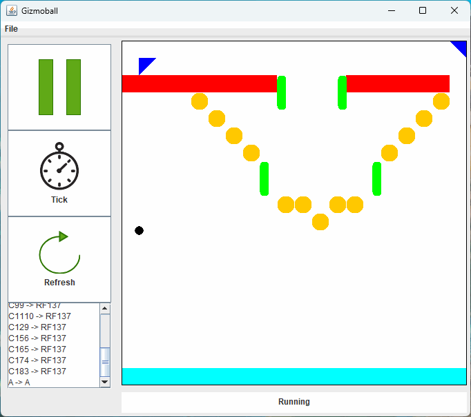
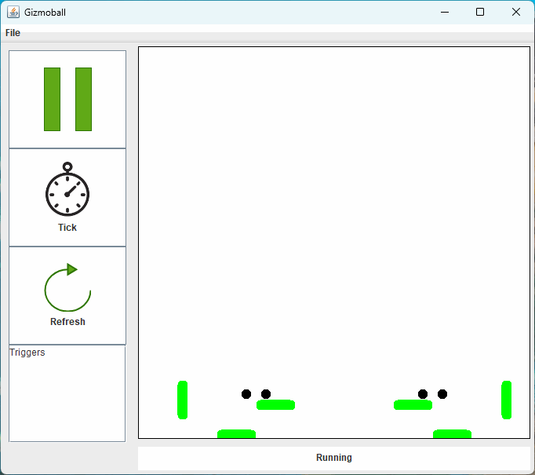
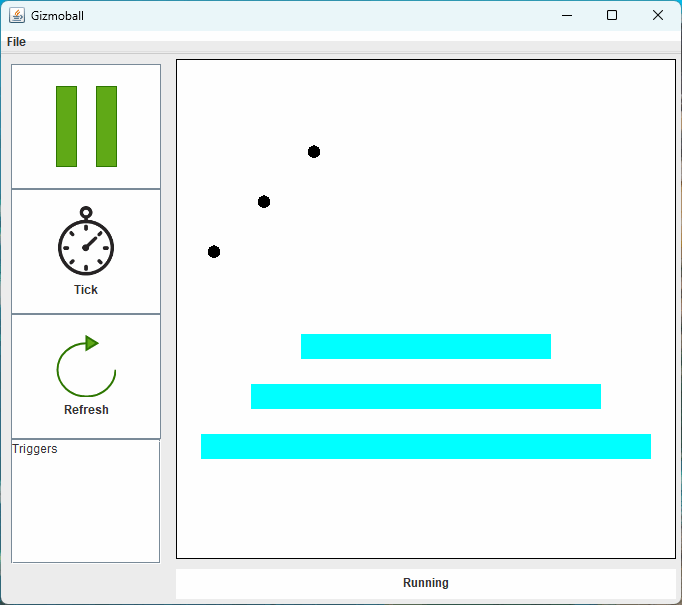
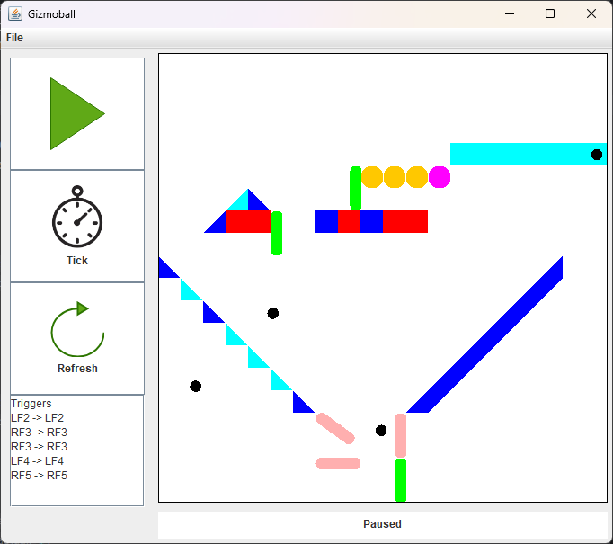
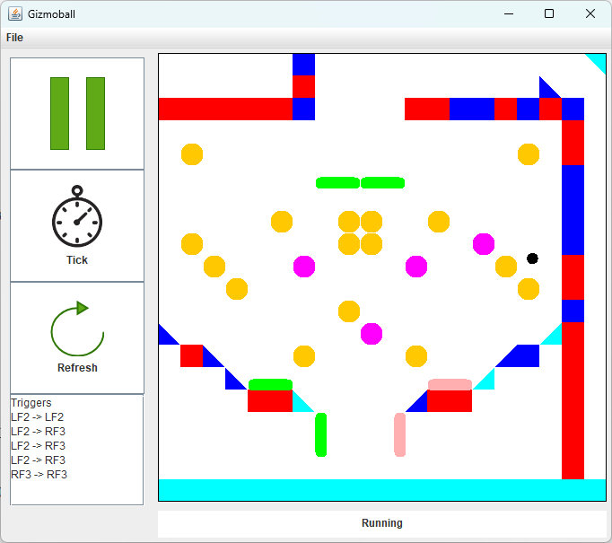

# Gizmoball

A physics-based pinball construction game built with Java, showcasing advanced software engineering principles, real-time physics simulation, and interactive gameplay.



---

## Table of Contents
- [Overview](#overview)
- [Features](#features)
- [Gizmo Types](#gizmo-types)
- [Demo](#demo)
- [Installation & Usage](#installation--usage)
- [Testing](#testing)
- [Technologies Used](#technologies-used)

---

## Overview

Gizmoball is an interactive physics simulation game where players design custom pinball boards using various gizmos (shapes, flippers, absorbers) and then simulate realistic ball physics. The project demonstrates clean MVC architecture, integration with a complex physics library, and a polished user experience.

### Key Achievements
- Implemented accurate physics simulation with gravity, friction, and collision detection
- Designed flexible trigger system allowing gizmos to activate each other or respond to keyboard input
- Built comprehensive save/load functionality with human-readable text format

---

## Features

### Build Mode
- **Visual Grid Editor**: 20×20 grid with drag-and-drop gizmo placement
- **5 Gizmo Types**: Squares, circles, triangles, flippers, and absorbers (see [Gizmo Types](#gizmo-types))
- **Edit Tools**: Place, move, rotate, delete, connect
- **Trigger System**:
  - Connect gizmos to trigger each other on collision
  - Bind keyboard keys to activate gizmos (on key press/release)
- **Physics Tuning**: Adjustable gravity and friction sliders
- **Ball Configuration**: Place balls with custom initial velocity

### Run Mode
- **Real-time Physics**: 50ms variable tick rate
- **Play/Pause Control**: Start and stop simulation
- **Single-Step Mode**: Advance one frame at a time for debugging
- **Keyboard Controls**: Activate bound flippers and absorbers during gameplay

### Save/Load System
- Text-based file format for easy editing
- Preserves all gizmos, connections, key bindings, and physics parameters
- Example levels included ([demo-level.txt](./Levels/demo-level.txt))

---

## Gizmo Types

| Gizmo | Size | Behavior | Visual |
|-------|------|----------|--------|
| **Circle** | 1×1 | Reflects balls | Orange → Magenta |
| **Square** | 1×1 | Reflects balls | Red → Blue |
| **Triangle** | 1×1 | Reflects balls | Blue → Cyan |
| **Flipper** | 2×2 | Rotates 90° on trigger, high reflection (0.95) | Green → Pink |
| **Absorber** | Variable | Captures balls, shoots upward on trigger | Cyan |


### Flipper Mechanics
- **Types**: Left and Right flippers (mirror behavior)
- **Animation**: Smooth 90° rotation
- **Physics**: Dynamic collision detection on rotating line segments
- **Control**: Keyboard-bindable for player control



### Absorber Behavior
- Captures any ball that enters its bounds
- Holds balls at bottom-right corner
- Releases with upward velocity when triggered



---

## Demo

### Build Mode Interface

*Build mode showing grid editor*

Features visible:
- Grid overlay with collision detection (red = occupied, green = available)
- Tool palette (Add, Move, Rotate, Delete, etc.)
- Connection panels for gizmo triggers and key bindings
- Physics parameter sliders (Gravity, Friction)
- Ball velocity configuration

### Run Mode Interface

*Run mode during active gameplay*

Features visible:
- Play/Pause/Tick controls
- Trigger list showing active connections
- Real-time physics simulation

### Example Level Design


---

## Installation & Usage

### Prerequisites
- Java JDK 8 or higher

### Running the Game

**Command Line:**
```bash
javac --release 8 -d out -sourcepath src src/Driver.java && cp Icons/*.png out/
java -cp out Driver
```

**IDE:**
1. Clone this repository
2. Open project in your Java IDE
3. Run `src/Driver.java` as Java application

### Basic Controls

**Build Mode:**
1. **Add Gizmo**: Select gizmo type → Click grid to place (drag for Absorber)
2. **Move**: Click gizmo → Click destination
3. **Rotate**: Click gizmo to rotate 90°
4. **Delete**: Select delete tool → Click gizmo
5. **Connect Gizmos**: Select Connect → Click trigger gizmo → Click action gizmo
6. **Bind Keyboard**: Select gizmo → Choose key → Select press/release event
7. **Physics**: Adjust gravity and friction sliders
8. **Save**: File → Save

**Run Mode:**
1. Switch to Run Mode using top button
2. **Play/Pause**: Start or stop simulation
3. **Tick**: Advance simulation by one frame
4. **Keyboard Controls**: Trigger bound gizmos (e.g., flippers)
5. **Refresh**: Reload level from file

**Example Level:**
Load `demo-level.txt` via File → Open to see:
- Pre-built level with all gizmo types
- Flippers bound to spacebar, Q, and W
- Trigger chains and cascading effects

---

## Testing

### Test Suite
- **Framework**: JUnit
- **Location**: `src/Testing/`

### Test Categories

**Unit Tests:**
- `AddingGizmoTests.java` - Editor functionality
- `CircleTest.java`, `SquareTest.java`, `TriangleTest.java` - Static gizmos
- `ConnectionTests.java` - Trigger system
- `FlipperTest.java`, `AbsorberTest.java` - Advanced gizmos
- `BallTest.java` - Ball behavior

### Running Tests

**Prerequisites:** Download JUnit libraries first:
```bash
curl -L -o lib/junit-4.13.2.jar https://repo1.maven.org/maven2/junit/junit/4.13.2/junit-4.13.2.jar
curl -L -o lib/hamcrest-core-1.3.jar https://repo1.maven.org/maven2/org/hamcrest/hamcrest-core/1.3/hamcrest-core-1.3.jar
```

**Command Line:**

Windows:
```bash
# Compile tests
javac --release 8 -cp "out;lib/junit-4.13.2.jar;lib/hamcrest-core-1.3.jar" -sourcepath src -d out src/Testing/*.java

# Run all 8 test classes
java -cp "out;lib/junit-4.13.2.jar;lib/hamcrest-core-1.3.jar" org.junit.runner.JUnitCore Testing.CircleTest Testing.SquareTest Testing.TriangleTest Testing.FlipperTest Testing.AbsorberTest Testing.BallTest Testing.AddingGizmoTests Testing.ConnectionTests
```

Linux/Mac:
```bash
# Compile tests
javac --release 8 -cp "out:lib/junit-4.13.2.jar:lib/hamcrest-core-1.3.jar" -sourcepath src -d out src/Testing/*.java

# Run all 8 test classes
java -cp "out:lib/junit-4.13.2.jar:lib/hamcrest-core-1.3.jar" org.junit.runner.JUnitCore Testing.CircleTest Testing.SquareTest Testing.TriangleTest Testing.FlipperTest Testing.AbsorberTest Testing.BallTest Testing.AddingGizmoTests Testing.ConnectionTests
```

**IDE:**
- Right-click `src/Testing/` → Run All Tests

---

## Technologies Used

**Core:**
- Java 8
- Swing (GUI)
- MIT Physics Library (Geometry, collision detection)

**Testing:**
- JUnit 4
- Test fixtures for reproducible scenarios

**Tools:**
- Git (version control)
- IntelliJ IDEA / Eclipse (development)
